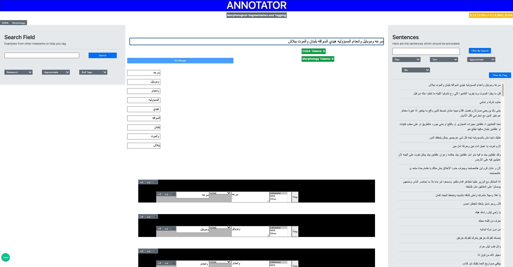

# Annotatio

This repository contains the code for the annotation software, *Annotatio*, that was developed in the scope of my Master's thesis which revolves around the standardization of orthography for Arabic dialects. This [link](https://drive.google.com/file/d/1VA4PZ1UKKQmpJXi0JYkh8miuOsNMDk-U/view?usp=sharing) takes you to the full thesis report, Chapter 3 of which contains all the information about this platform.

## Disclaimer
This repository has yet to be polished and is still in the same state in which it was left at submission time. It was not in any way made to be user-friendly, and was pushed for the time being for purely administrative reasons. It will soon be overhauled and released in a form which is more readily usable.

  

## Some Information
*Annotatio* was developed using *Flask* and *JavaScript*, and is in no way a final product since it still needs heavy tweaking.

It allows annotators to perform:
- Source-target pair Segmentation
- Orthography Standardization
- Morphological Segmentation
- Morphological (+ POS) Tagging
- Spontaneous Orthography Tagging

## Running the App
To run the app, the following is required:

- Python >= 3.5
- Flask (latest version)

Then, simply run:

    python3 app.py

and open `127.0.0.1:5000` on your browser. Sentences which are in the `annotatio/annotations/corpus` files will be saved to a file in `annotatio/annotations` named `annotations_$NAME.json` where `$NAME` is specified as the value of the `current_annotator` key in the `annotatio/config.json` file.